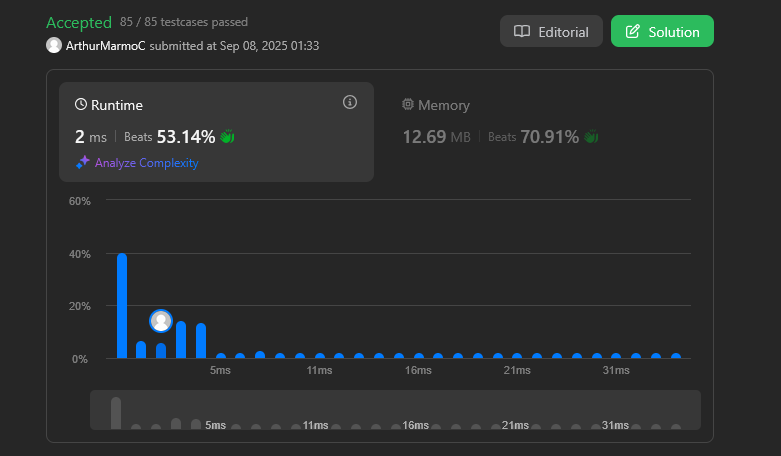
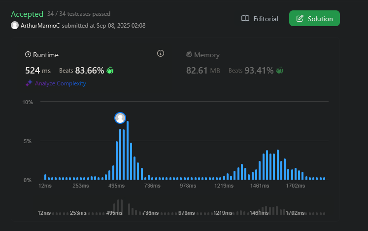

# Grafos 1 - Leetcode

**Conteúdo do Trabalho**: Grafos 

## Alunos
|Matrícula | Aluno |
| -- | -- |
| 211043610  |  Arthur Marmo Cathalá |
| xx/xxxxxx  |  Daniele Rodrigues Silva |

## Sobre 
Nesse projeto apresentamos soluções de exercícios do Leetcode

## Screenshots das Submissões

### 1 - Médio - [Is Graph Bipartite](https://leetcode.com/problems/is-graph-bipartite/description/)

### 2 - Fácil - [Find if Path Exists in Graph](https://leetcode.com/problems/find-if-path-exists-in-graph/description/)

