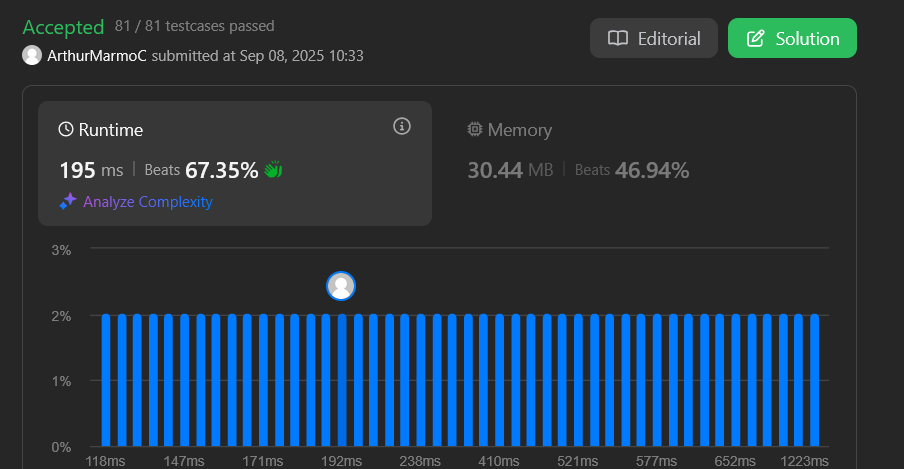
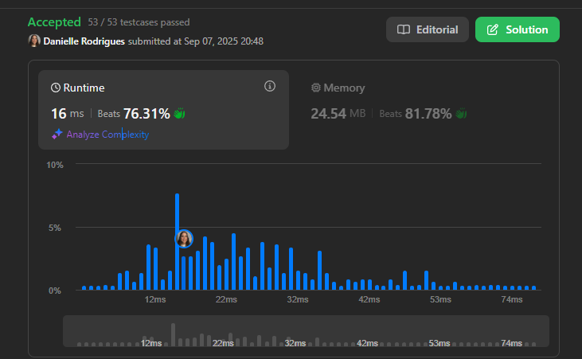
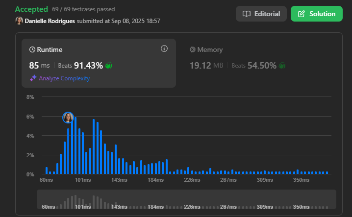

# Grafos 1 - Leetcode

**Conteúdo do Trabalho**: Grafos 

## Alunos
|Matrícula | Aluno |
| -- | -- |
| 211043610  |  Arthur Marmo Cathalá |
| 211061574  |  Danielle Rodrigues Silva |

## Sobre 
Nesse projeto apresentamos soluções de exercícios do Leetcode usando Python.

## Screenshots das Submissões

### 1 - Médio - [Is Graph Bipartite](https://leetcode.com/problems/is-graph-bipartite/description/)

### 2 - Fácil - [Find if Path Exists in Graph](https://leetcode.com/problems/find-if-path-exists-in-graph/description/)

### 3 - Difícil - [Longest Cycle in a Graph](https://leetcode.com/problems/longest-cycle-in-a-graph/description/)

### 4 - Difícil - [Build a Matrix With Conditions](https://leetcode.com/problems/build-a-matrix-with-conditions/description/)

### 5 - Difícil - [Minimum Cost to Make at Least One Valid Path in a Grid](https://leetcode.com/problems/minimum-cost-to-make-at-least-one-valid-path-in-a-grid/description/)

## Vídeo de apresentação do Trabalho 1

[Vídeo da apresentação no yt](https://youtu.be/B9MlKc0Q_9I)

